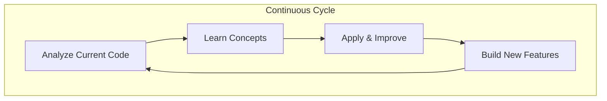
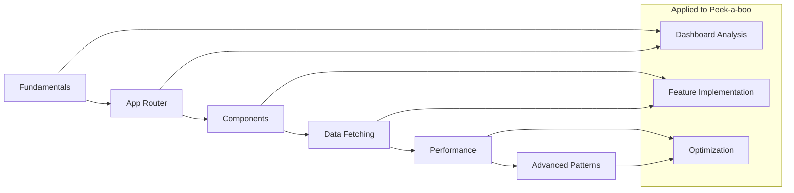

# Next.js Mastery Learning Design

## Overview

This design outlines a comprehensive, hands-on Next.js learning program specifically tailored to your Peek-a-boo feature flag management platform. Rather than abstract tutorials, we'll learn by analyzing, improving, and extending your existing Next.js 14 application.

Your current setup provides an excellent foundation:
- **Next.js 14 with App Router** - Modern routing system
- **Domain-driven architecture** - Well-organized code structure
- **Route groups** - Using `(auth)` for protected routes
- **Tailwind CSS + Radix UI** - Modern styling approach
- **TypeScript** - Type-safe development
- **Monorepo with Turbo** - Scalable project structure

## Architecture

### Learning Methodology

We'll follow a **Learn-by-Doing** approach with three phases:



### Knowledge Building Blocks



## Components and Interfaces

### 1. Learning Environment Setup

**Current Analysis Interface**
```typescript
interface CurrentCodeAnalysis {
  routingStructure: AppRouterPattern;
  componentArchitecture: DomainDrivenDesign;
  dataFlow: ServerClientBoundary;
  performanceMetrics: WebVitals;
}
```

**Learning Session Interface**
```typescript
interface LearningSession {
  concept: NextJSConcept;
  currentImplementation: CodeExample;
  improvements: OptimizationOpportunity[];
  practicalApplication: FeatureImplementation;
}
```

### 2. Progressive Learning Modules

#### Module 1: Next.js Fundamentals & Your Current Setup
- **Analyze**: Your current `layout.tsx` and routing structure
- **Learn**: App Router vs Pages Router, file-based routing
- **Apply**: Optimize your current route organization
- **Build**: Add new routes for upcoming features

#### Module 2: Server vs Client Components Deep Dive
- **Analyze**: Your current component boundaries
- **Learn**: When to use Server vs Client Components
- **Apply**: Refactor components for better performance
- **Build**: Implement new dashboard widgets

#### Module 3: Data Fetching Strategies
- **Analyze**: How your dashboard currently fetches project data
- **Learn**: SSR, SSG, ISR, CSR trade-offs
- **Apply**: Optimize flag loading performance
- **Build**: Real-time flag status updates

#### Module 4: Advanced Routing & Layouts
- **Analyze**: Your `(auth)` route group and nested layouts
- **Learn**: Route groups, parallel routes, intercepting routes
- **Apply**: Improve your authentication flow
- **Build**: Modal routes for flag editing

#### Module 5: Performance Optimization
- **Analyze**: Current bundle size and loading performance
- **Learn**: Code splitting, image optimization, caching
- **Apply**: Optimize your dashboard loading times
- **Build**: Implement progressive loading for large flag lists

### 3. Practical Application Framework

Each learning module follows this structure:

```typescript
interface LearningModule {
  // 1. Understand current implementation
  currentState: {
    codeAnalysis: string;
    performanceMetrics: Metrics;
    userExperience: UXAssessment;
  };
  
  // 2. Learn new concepts
  concepts: {
    theory: ConceptExplanation;
    bestPractices: BestPractice[];
    commonPitfalls: Pitfall[];
  };
  
  // 3. Apply to your project
  improvements: {
    refactoring: CodeImprovement[];
    optimization: PerformanceGain[];
    newFeatures: FeatureAddition[];
  };
  
  // 4. Measure results
  outcomes: {
    performanceGains: Metrics;
    codeQuality: QualityMetrics;
    developerExperience: DXImprovement;
  };
}
```

## Data Models

### Learning Progress Tracking

```typescript
interface LearningProgress {
  module: string;
  conceptsLearned: Concept[];
  practicalApplications: Application[];
  codeImprovements: Improvement[];
  performanceGains: PerformanceMetric[];
  nextSteps: NextStep[];
}

interface Concept {
  name: string;
  description: string;
  appliedTo: string; // Which part of Peek-a-boo
  masteryLevel: 'beginner' | 'intermediate' | 'advanced';
  practicalExamples: CodeExample[];
}

interface Application {
  feature: string;
  beforeCode: string;
  afterCode: string;
  improvements: string[];
  performanceImpact: PerformanceMetric;
}
```

### Feature Flag Learning Context

```typescript
interface FeatureFlagContext {
  // Your existing features we'll enhance
  currentFeatures: {
    dashboard: DashboardFeature;
    projects: ProjectFeature;
    flags: FlagFeature;
  };
  
  // New features we'll build while learning
  newFeatures: {
    realTimeUpdates: WebSocketIntegration;
    advancedFiltering: SearchOptimization;
    bulkOperations: BatchProcessing;
    analytics: DataVisualization;
  };
}
```

## Error Handling

### Learning Error Recovery

```typescript
interface LearningErrorHandling {
  // When concepts are unclear
  conceptClarification: {
    alternativeExplanations: string[];
    visualDiagrams: Diagram[];
    practicalExamples: CodeExample[];
  };
  
  // When code doesn't work
  debuggingSupport: {
    commonIssues: Issue[];
    stepByStepDebugging: DebuggingStep[];
    workingExamples: CodeExample[];
  };
  
  // When performance is poor
  optimizationGuidance: {
    performanceAnalysis: Analysis;
    optimizationStrategies: Strategy[];
    measurementTools: Tool[];
  };
}
```

### Next.js Error Boundaries in Your App

We'll learn error handling by improving your current error handling:

```typescript
// Current: apps/dashboard/src/app/(auth)/projects/error.tsx
// We'll enhance this and create more sophisticated error boundaries

interface ErrorBoundaryLearning {
  currentImplementation: string;
  improvements: ErrorHandlingPattern[];
  userExperienceEnhancements: UXImprovement[];
}
```

## Testing Strategy

### Learning Validation Approach

```typescript
interface LearningValidation {
  // Concept understanding
  conceptTests: {
    theoreticalQuestions: Question[];
    practicalChallenges: Challenge[];
    codeReview: ReviewCriteria[];
  };
  
  // Application success
  applicationTests: {
    performanceMetrics: Metric[];
    codeQuality: QualityCheck[];
    userExperience: UXMetric[];
  };
  
  // Real-world application
  projectImprovements: {
    beforeAfterComparison: Comparison;
    measurableImprovements: Improvement[];
    newCapabilities: Capability[];
  };
}
```

### Testing Your Next.js Knowledge

We'll validate learning through:

1. **Code Analysis**: Understanding your current implementation
2. **Improvement Implementation**: Making measurable enhancements
3. **Feature Building**: Creating new functionality
4. **Performance Measurement**: Quantifying improvements
5. **Best Practice Application**: Following Next.js conventions

## Implementation Phases

### Phase 1: Foundation Analysis (Week 1)
- Deep dive into your current Next.js setup
- Understand App Router implementation
- Analyze component architecture
- Identify optimization opportunities

### Phase 2: Core Concepts Mastery (Week 2-3)
- Server vs Client Components
- Data fetching strategies
- Routing patterns
- Performance optimization basics

### Phase 3: Advanced Patterns (Week 4-5)
- Complex routing scenarios
- Advanced data fetching
- Caching strategies
- Error handling patterns

### Phase 4: Real-World Application (Week 6-8)
- Implement new dashboard features
- Optimize existing functionality
- Add real-time capabilities
- Performance monitoring

### Phase 5: Mastery & Innovation (Week 9-10)
- Advanced Next.js patterns
- Custom optimizations
- Innovative feature implementations
- Knowledge consolidation

## Learning Resources Integration

### Documentation Deep Dives
- Next.js official documentation with practical application
- React Server Components RFC analysis
- Performance optimization guides

### Code Examples from Your Project
- Every concept illustrated with your actual code
- Before/after comparisons
- Performance impact measurements

### Community Best Practices
- Industry patterns applied to feature flags
- Open source examples relevant to your use case
- Performance benchmarking against similar applications

## Success Metrics

### Knowledge Acquisition
- Concept understanding depth
- Practical application success
- Code quality improvements
- Performance optimizations achieved

### Project Improvements
- Dashboard loading time improvements
- Bundle size optimizations
- User experience enhancements
- New feature implementations

### Developer Experience
- Development workflow improvements
- Debugging capability enhancements
- Code maintainability increases
- Team knowledge sharing

This design ensures that every Next.js concept you learn has immediate, practical application to your Peek-a-boo platform, making the learning both engaging and valuable for your real-world project.