# 🏗️ Peek-a-boo Architecture Diagrams

## 📊 System Architecture Overview

```mermaid
graph TB
    subgraph "Peek-a-boo Monorepo"
        subgraph "Apps"
            Dashboard["🖥️ Dashboard<br/>(Next.js)"]
            SDKService["⚡ SDK Service<br/>(NestJS)"]
        end
        
        subgraph "Packages"
            Shared["📦 Shared<br/>(Prisma + Types)"]
            ClientSDK["📚 Client SDK<br/>(Rollup)"]
        end
        
        subgraph "External Services"
            Supabase["🗄️ Supabase<br/>(Database)"]
            Vercel["🚀 Vercel<br/>(Dashboard Host)"]
            Railway["🚂 Railway<br/>(API Host)"]
        end
    end
    
    Dashboard --> Shared
    SDKService --> Shared
    ClientSDK --> Shared
    
    Dashboard --> Supabase
    SDKService --> Supabase
    
    Dashboard -.-> Vercel
    SDKService -.-> Railway
    
    classDef app fill:#e1f5fe,stroke:#01579b,stroke-width:2px
    classDef package fill:#f3e5f5,stroke:#4a148c,stroke-width:2px
    classDef external fill:#e8f5e8,stroke:#1b5e20,stroke-width:2px
    
    class Dashboard,SDKService app
    class Shared,ClientSDK package
    class Supabase,Vercel,Railway external
```



## 🔄 Turborepo Task Pipeline

```mermaid
graph LR
    subgraph "Build Pipeline"
        A[📦 shared<br/>prisma generate + tsc] --> B[📚 client-sdk<br/>rollup build]
        A --> C[🖥️ dashboard<br/>next build]
        A --> D[⚡ sdk-service<br/>nest build]
    end
    
    subgraph "Dev Pipeline"
        E[📦 shared<br/>tsc --watch] -.-> F[📚 client-sdk<br/>rollup --watch]
        E -.-> G[🖥️ dashboard<br/>next dev :3000]
        E -.-> H[⚡ sdk-service<br/>nest start --watch :3001]
    end
    
    classDef shared fill:#fff3e0,stroke:#e65100,stroke-width:2px
    classDef build fill:#e8f5e8,stroke:#2e7d32,stroke-width:2px
    classDef dev fill:#e3f2fd,stroke:#1565c0,stroke-width:2px
    
    class A,E shared
    class B,C,D build
    class F,G,H dev
```



## 🏃‍♂️ Development Workflow

```mermaid
sequenceDiagram
    participant Dev as 👨‍💻 Developer
    participant Turbo as 🚀 Turborepo
    participant Cache as 💾 Cache
    participant Apps as 📱 Applications
    
    Dev->>Turbo: pnpm dev
    Turbo->>Cache: Check for cached builds
    Cache-->>Turbo: Cache miss/hit status
    
    alt Cache Hit
        Turbo->>Apps: Start from cache
    else Cache Miss
        Turbo->>Apps: Fresh build + start
        Apps->>Cache: Store build artifacts
    end
    
    Apps-->>Dev: Hot reload ready
    
    Dev->>Turbo: Make code changes
    Turbo->>Turbo: Detect affected packages
    Turbo->>Apps: Rebuild only affected
    Apps-->>Dev: Hot reload updates
```



## 📦 Package Dependencies

```mermaid
graph TD
    subgraph "Dependency Graph"
        Shared["📦 @peek-a-boo/shared<br/>• Prisma client<br/>• Database types<br/>• Shared utilities"]
        
        Dashboard["🖥️ @peek-a-boo/dashboard<br/>• Next.js app<br/>• Admin interface<br/>• Authentication"]
        
        SDKService["⚡ @peek-a-boo/sdk-service<br/>• NestJS API<br/>• WebSocket server<br/>• Feature flag logic"]
        
        ClientSDK["📚 @peek-a-boo/client-sdk<br/>• JavaScript SDK<br/>• Feature flag client<br/>• Multiple formats"]
    end
    
    Shared --> Dashboard
    Shared --> SDKService  
    Shared --> ClientSDK
    
    classDef shared fill:#fff8e1,stroke:#f57f17,stroke-width:3px
    classDef dependent fill:#f3e5f5,stroke:#7b1fa2,stroke-width:2px
    
    class Shared shared
    class Dashboard,SDKService,ClientSDK dependent
```



## 🚀 Deployment Flow

```mermaid
graph TB
    subgraph "Source Control"
        Git["📝 Git Repository<br/>• Feature branches<br/>• Pull requests<br/>• Main branch"]
    end
    
    subgraph "CI/CD Pipeline"
        CI["🔄 GitHub Actions<br/>• Install dependencies<br/>• Run turbo build<br/>• Run tests"]
    end
    
    subgraph "Build Outputs"
        DashBuild["🖥️ Dashboard Build<br/>• Static files<br/>• Optimized assets"]
        ServiceBuild["⚡ Service Build<br/>• Compiled JS<br/>• Docker image"]
    end
    
    subgraph "Deployment Targets"
        VercelDeploy["🚀 Vercel<br/>• Dashboard hosting<br/>• CDN distribution"]
        RailwayDeploy["🚂 Railway<br/>• API hosting<br/>• WebSocket support"]
    end
    
    Git --> CI
    CI --> DashBuild
    CI --> ServiceBuild
    DashBuild --> VercelDeploy
    ServiceBuild --> RailwayDeploy
    
    classDef source fill:#e8f5e8,stroke:#2e7d32,stroke-width:2px
    classDef pipeline fill:#fff3e0,stroke:#f57c00,stroke-width:2px
    classDef build fill:#e3f2fd,stroke:#1565c0,stroke-width:2px
    classDef deploy fill:#fce4ec,stroke:#c2185b,stroke-width:2px
    
    class Git source
    class CI pipeline
    class DashBuild,ServiceBuild build
    class VercelDeploy,RailwayDeploy deploy
```



## 🎯 Feature Flag Flow


## 📈 Performance Metrics

```mermaid
graph TB
    subgraph "Build Performance"
        A["⏱️ Build Times"]
        A --> A1["Without Turbo: 5-8 min"]
        A --> A2["With Turbo: 1-3 min"]
        A --> A3["Cache Hit: 30s-1min"]
    end
    
    subgraph "Development Experience"
        B["🔄 Hot Reload"]
        B --> B1["Shared changes: <2s"]
        B --> B2["App changes: <1s"]
        B --> B3["Type updates: <3s"]
    end
    
    subgraph "Cache Efficiency"
        C["💾 Cache Rates"]
        C --> C1["Local Dev: 80-90%"]
        C --> C2["CI/CD: 60-70%"]
        C --> C3["Clean Build: 0%"]
    end
    
    classDef metric fill:#e8f5e8,stroke:#2e7d32,stroke-width:2px
    classDef good fill:#c8e6c9,stroke:#388e3c,stroke-width:1px
    classDef better fill:#a5d6a7,stroke:#2e7d32,stroke-width:1px
    classDef best fill:#81c784,stroke:#1b5e20,stroke-width:1px
    
    class A,B,C metric
    class A1,B3,C3 good
    class A2,B1,C2 better  
    class A3,B2,C1 best
```

---

*These diagrams are rendered using Mermaid syntax and can be viewed in GitHub, GitLab, or any Mermaid-compatible viewer.*