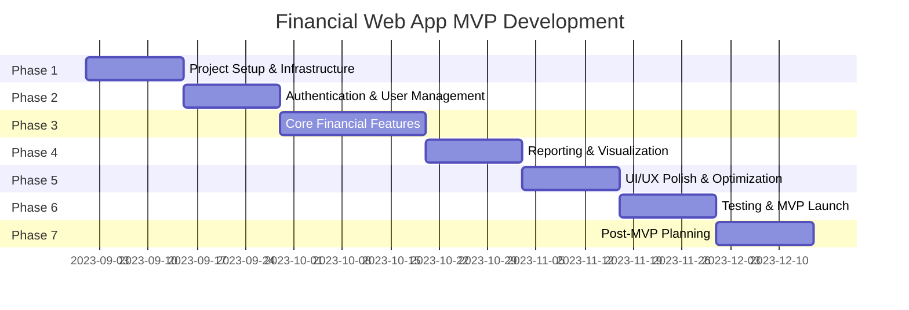

# Financial Web App Startup - Project Plan

## Executive Summary

This document outlines the plan for developing an MVP for a financial web application. The approach prioritizes speed and quality while maintaining a scalable architecture that can evolve with the business.

## Technology Stack

### Frontend

- **Framework**: [Next.js](https://nextjs.org/)
  - React-based framework with built-in routing, server-side rendering, and API routes
  - Strong TypeScript support
  - Great developer experience and fast development cycles
- **Language**: [TypeScript](https://www.typescriptlang.org/)
  - Type safety for financial data
  - Better developer experience and fewer runtime errors
- **UI Components**: [Tailwind CSS](https://tailwindcss.com/) + [Shadcn UI](https://ui.shadcn.com/)
  - Utility-first approach for rapid UI development
  - Consistent design system with customizable components
- **State Management**: React Context + [TanStack Query](https://tanstack.com/query/latest) (formerly React Query)
  - Efficient data fetching, caching, and state synchronization
  - Reduces boilerplate code

### Backend

- **API Layer**: Next.js API Routes (built into the frontend)
  - Simplified deployment and maintenance
  - Unified TypeScript codebase
- **Database**: [PostgreSQL](https://www.postgresql.org/)
  - Reliable, robust for financial data
  - Strong data integrity guarantees
- **ORM**: [Prisma](https://www.prisma.io/)
  - Type-safe database queries
  - Database migrations and schema management
  - Excellent DX with TypeScript integration

### Authentication

- **Auth Framework**: [NextAuth.js](https://next-auth.js.org/) / [Auth.js](https://authjs.dev/)
  - Easy to implement secure authentication
  - Support for multiple providers (email/password, social logins)
  - JWT-based session management

### Hosting & Deployment

- **Frontend & API**: [Vercel](https://vercel.com/) (free tier to start)
  - Optimized for Next.js
  - CI/CD built-in
  - Global CDN
- **Database**: [Supabase](https://supabase.com/) (free tier to start) or [Railway](https://railway.app/) (affordable paid option)
  - Managed PostgreSQL
  - Built-in backups
  - Reasonable free tier limits

### Development Tools

- **Version Control**: Git + GitHub
  - Pull request workflow
  - Code reviews
- **Linting**: ESLint + Prettier
  - Consistent code style
  - Automated code quality checks
- **CI/CD**: GitHub Actions
  - Automated testing and deployment
  - Code quality gates

### Monitoring & Analytics

- **Error Tracking**: [Sentry](https://sentry.io/) (free tier)
  - Real-time error tracking
  - Performance monitoring
- **Analytics**: [Plausible](https://plausible.io/) or [Google Analytics](https://analytics.google.com/)
  - Privacy-focused analytics (Plausible)
  - Comprehensive free tier (Google Analytics)

---

## Development Phases

### Phase 1: Project Setup & Infrastructure (2 weeks)

**Objectives:**

- Establish development environment
- Set up project structure and core dependencies
- Configure CI/CD pipeline
- Set up database schema and initial migrations

**Key Tasks:**

1. Initialize Next.js project with TypeScript
2. Configure ESLint and Prettier
3. Set up GitHub repository and branch protection rules
4. Configure Tailwind CSS and component library
5. Set up Prisma and initial database schema
6. Deploy skeleton app to Vercel
7. Configure database hosting on Supabase/Railway
8. Set up GitHub Actions for CI/CD

**Deliverables:**

- Working development environment
- Project repository with main/development branches
- Deployed skeleton application
- Database connection and initial schema

---

### Phase 2: Authentication & User Management (2 weeks)

**Objectives:**

- Implement secure user authentication
- Create user profile management
- Establish role-based access control

**Key Tasks:**

1. Set up NextAuth.js with email/password provider
2. Create registration and login flows
3. Design and implement user profile pages
4. Establish user roles and permissions
5. Add password reset functionality
6. Implement email verification

**Deliverables:**

- Complete authentication system
- User profile management
- Role-based access control
- Email notifications system

---

### Phase 3: Core Financial Features (3 weeks)

**Objectives:**

- Implement manual financial data entry
- Create core financial data models
- Build basic financial analysis features

**Key Tasks:**

1. Design and implement financial data models (accounts, transactions, categories)
2. Create forms for manual data entry
3. Build transaction management interface
4. Implement basic categorization system
5. Create data validation rules
6. Build basic financial summary views

**Deliverables:**

- Financial data entry system
- Transaction management
- Categorization functionality
- Basic financial summaries

---

### Phase 4: Reporting & Visualization (2 weeks)

**Objectives:**

- Create visual reports of financial data
- Implement filtering and aggregation features
- Build customizable dashboards

**Key Tasks:**

1. Integrate charting library ([Recharts](https://recharts.org/en-US/) or [Chart.js](https://www.chartjs.org/))
2. Implement financial reporting views
3. Create filtering and time period selection
4. Build customizable dashboard
5. Implement data export functionality

**Deliverables:**

- Visual financial reports
- Interactive filtering system
- Customizable user dashboard
- Data export functionality

---

### Phase 5: UI/UX Polish & Optimization (2 weeks)

**Objectives:**

- Improve overall user experience
- Optimize application performance
- Ensure responsive design works well on all devices

**Key Tasks:**

1. Conduct UX review and implement improvements
2. Optimize component rendering and data fetching
3. Implement loading states and error handling
4. Ensure accessibility compliance
5. Test and optimize responsive layouts
6. Add progressive features (e.g., keyboard shortcuts)

**Deliverables:**

- Polished user interface
- Optimized application performance
- Accessible and responsive design
- Improved error handling and user feedback

---

### Phase 6: Testing & MVP Launch (2 weeks)

**Objectives:**

- Ensure application stability
- Prepare for public launch
- Set up monitoring and analytics

**Key Tasks:**

1. Implement critical manual test cases
2. Set up error tracking with Sentry
3. Configure analytics
4. Create user documentation
5. Perform security review
6. Finalize deployment pipeline
7. Soft launch to beta users

**Deliverables:**

- Stable MVP ready for users
- Monitoring and analytics setup
- User documentation
- Feedback collection system

---

### Phase 7: Post-MVP Planning (2 weeks)

**Objectives:**

- Plan for post-MVP features
- Research integration opportunities
- Establish roadmap for testing strategy

**Key Tasks:**

1. Prioritize feature backlog based on user feedback
2. Research external financial tool integrations
3. Investigate payment processing options
4. Plan automated testing strategy
5. Evaluate infrastructure scaling needs
6. Create roadmap for next development cycle

**Deliverables:**

- Post-MVP roadmap
- Integration research report
- Testing strategy document
- Infrastructure scaling plan

---

## Future Considerations

### Integrations

- Financial institution APIs
- Payment processors (Stripe, PayPal)
- Accounting software (QuickBooks, Xero)
- Tax preparation tools

### Advanced Features

- Automated categorization using ML
- Budget forecasting
- Financial goal tracking
- Investment portfolio management

### Infrastructure Scaling

- Database performance optimization
- Caching strategies
- Potential microservices architecture for specific features

### Monetization Strategies

- Freemium model with premium features
- Subscription tiers
- Payment processing fees
- White-label options for businesses

---

## Conclusion

This plan provides a structured approach to developing a financial web application MVP while balancing speed, quality, and cost-effectiveness. The technology stack is modern, scalable, and optimized for developer productivity, allowing the team to move quickly while building a solid foundation for future growth.

The phased approach ensures that key functionality is delivered incrementally, allowing for user feedback to inform ongoing development. The plan prioritizes core financial features while establishing a path toward more advanced capabilities in the future.
