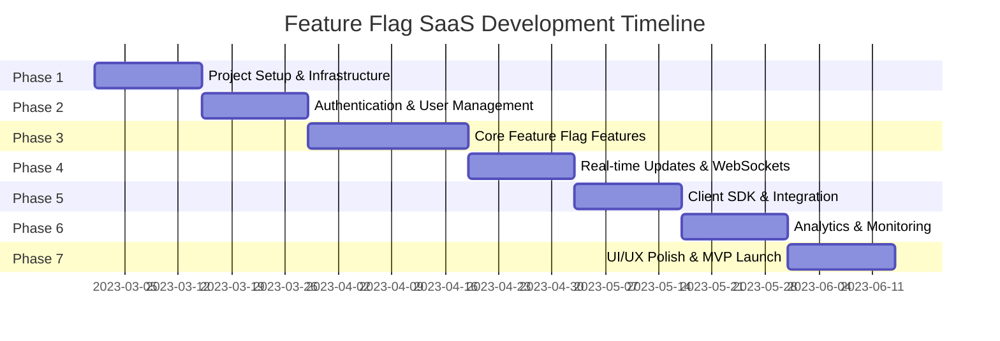

# Feature Flag SaaS Platform - Project Phases

This document outlines the development phases for our Feature Flag SaaS platform. Each phase has specific goals, deliverables, and tasks that must be completed before moving to the next phase.

## Progress Overview

| Phase | Description | Status | Progress |
|-------|-------------|--------|----------|
| [Phase 1](./01-project-setup.md) | Project Setup & Infrastructure | 🚧 In Progress | 85% |
| [Phase 2](./02-authentication.md) | Authentication & User Management | 📅 Planned | 0% |
| [Phase 3](./03-core-features.md) | Core Feature Flag Features | 📅 Planned | 0% |
| [Phase 4](./04-realtime-updates.md) | Real-time Updates & WebSockets | 📅 Planned | 0% |
| [Phase 5](./05-client-sdk.md) | Client SDK & Integration | 📅 Planned | 0% |
| [Phase 6](./06-analytics.md) | Analytics & Monitoring | 📅 Planned | 0% |
| [Phase 7](./07-polish-launch.md) | UI/UX Polish & MVP Launch | 📅 Planned | 0% |

## Status Legend

- ✅ Completed
- 🚧 In Progress
- 📅 Planned
- ⏸️ On Hold

## Phase Timeline

## Key Milestones

1. **Initial Setup Complete** - End of Phase 1
   - Development environment configured
   - Project structure established
   - Database schema created
   - Basic deployment pipeline set up

2. **Core Platform Functional** - End of Phase 3
   - User authentication system working
   - Feature flag management operational
   - Admin dashboard functional

3. **Real-time Capability** - End of Phase 4
   - WebSocket infrastructure implemented
   - Real-time flag updates working

4. **Client Integration Ready** - End of Phase 5
   - Client SDK published
   - Integration documentation complete

5. **MVP Launch** - End of Phase 7
   - Platform fully functional
   - UI polished
   - Documentation complete
   - Ready for initial customers

## Dependencies and Critical Path

The development follows a sequential path with each phase building on the previous one. Critical path items include:

- Database schema design (impacts all phases)
- Authentication system (required for feature flag management)
- WebSocket infrastructure (required for real-time updates)
- SDK design (impacts client integration experience)

## Risk Management

Key risks and mitigation strategies are documented in each phase plan. Overall project risks include:

1. **Technical Complexity** - The hybrid architecture with Next.js and NestJS requires careful coordination
2. **Performance Challenges** - Real-time updates at scale may require optimization
3. **Security Considerations** - Feature flags control application behavior, requiring robust security

## Phase Details

For detailed task breakdowns, dependencies, and progress tracking for each phase, see the individual phase documents:

- [Phase 1: Project Setup & Infrastructure](./01-project-setup.md)
- [Phase 2: Authentication & User Management](./02-authentication.md)
- [Phase 3: Core Feature Flag Features](./03-core-features.md)
- [Phase 4: Real-time Updates & WebSockets](./04-realtime-updates.md)
- [Phase 5: Client SDK & Integration](./05-client-sdk.md)
- [Phase 6: Analytics & Monitoring](./06-analytics.md)
- [Phase 7: UI/UX Polish & MVP Launch](./07-polish-launch.md) 